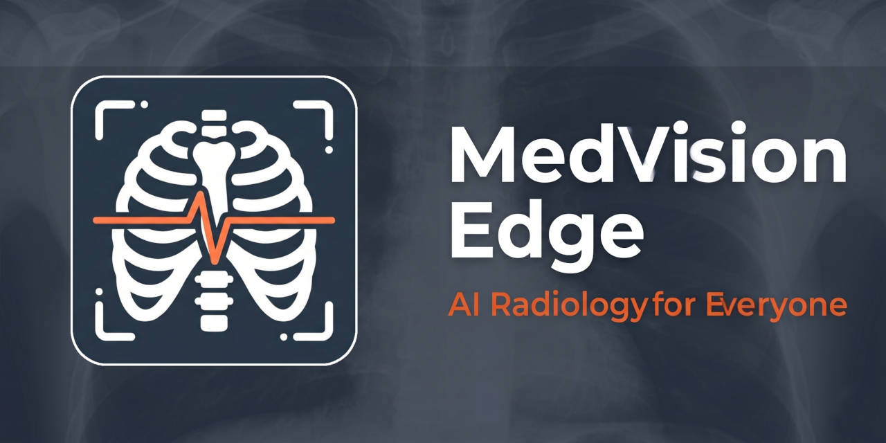
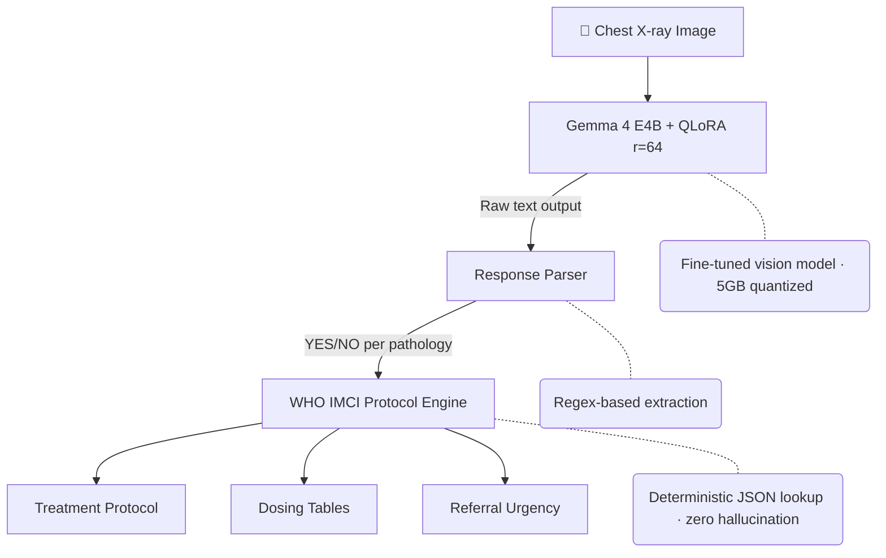

<p align="center">
  
</p>

# MedVision Edge — Offline Chest X-ray Analysis

AI-powered chest X-ray screening for underserved communities, using **Gemma 4 E4B** fine-tuned on ~23K radiographs from NIH ChestX-ray14 (112K-image dataset, with capacity for further scaling). Runs entirely offline on consumer hardware.

**Video Demo:** https://youtu.be/VFHtjTz7u2U

## The Problem

- **2.2 billion people** lack access to diagnostic imaging (WHO 2023)
- **1 radiologist per 1M inhabitants** in sub-Saharan Africa
- Similar shortages across rural Latin America, South Asia, and the Pacific Islands
- **740,000 children under 5** die from pneumonia annually, many preventable with early diagnosis
- Cloud-based ML costs $0.03-0.10/image — unaffordable without internet

## Our Solution

MedVision Edge brings AI radiology screening to the 7M+ rural health workers who need it most:

1. **Photograph a chest X-ray** with any smartphone or tablet
2. **Gemma 4 E4B analyzes locally** in 3-5 seconds, no internet required
3. **WHO IMCI protocols** provide evidence-based treatment guidance
4. **140+ languages** supported natively — no translation API needed
5. **Deterministic clinical protocols** — drug dosing and referral urgency with zero hallucination risk

## Results

Validated on two independent benchmarks with real clinical images:

| Pathology | Base AUC | Fine-tuned AUC (N=1,103) | CheXpert Gold Std (N=500) | Δ vs Base |
|-----------|----------|--------------------------|---------------------------|-----------|
| Cardiomegaly | 0.490 | **0.832** | 0.723 | **+70%** |
| Pleural Effusion | 0.605 | 0.703 | **0.797** | +16% |
| Pulmonary Edema | 0.688 | **0.753** | 0.668 | +9% |
| Consolidation | 0.599 | 0.627 | **0.667** | +5% |
| Pneumonia | 0.519 | **0.617** | 0.501* | +19% |

*Base AUC: unmodified Gemma 4 (zero-shot). Fine-tuned AUC: our model, evaluated on 1,103 held-out NIH images. CheXpert: same model evaluated on 500 independent images with 5-radiologist consensus labels (Stanford).*

*\*Pneumonia CheXpert: only 11 positives (2.2% prevalence) — insufficient statistical power. Pneumonia detection remains under active development.*

### Key achievements

- Fine-tuned model detects pathologies the base model completely misses (Cardiomegaly: base AUC 0.490 vs ours 0.832)
- Sensitivity >0.63 across all pathologies — the model reads images, not just text patterns
- Effusion AUC 0.797 on gold standard benchmark with 95.2% sensitivity
- All results reproducible with provided scripts and public datasets

## Architecture



## Technical Details

- **Base model**: `unsloth/gemma-4-E4B-it` (6.3B params)
- **Fine-tuning**: QLoRA with Unsloth (r=64, 82M trainable params = 1.3% of total)
- **Training data**: NIH ChestX-ray14 (112,120 image dataset), ~23K training samples with 5x oversampling and augmentation
- **Training**: 2 epochs, lr 1e-4, gradient accumulation 8, data augmentation
- **Hardware**: NVIDIA RTX 5070 Ti 16GB (~43h total GPU time)
- **Deployment**: 5GB GGUF via Ollama (text) or Gradio with transformers (vision)
- **Protocols**: WHO IMCI 2024, ESC Guidelines, BTS Guidelines

## Project Structure

```
medvision-edge/
├── app.py                    # Gradio web interface
├── src/
│   └── protocols.py          # WHO IMCI protocol engine (deterministic)
├── protocols/
│   ├── pneumonia.json        # Clinical guidelines per pathology
│   ├── consolidation.json
│   ├── cardiomegaly.json
│   ├── effusion.json
│   ├── edema.json
│   ├── dosage.json           # Pediatric weight-based dosing tables
│   └── referral.json         # Urgency classification criteria
├── scripts/
│   ├── data_prep.py          # NIH dataset preparation
│   ├── create_conversation_dataset_v4.py  # Training data formatting
│   ├── finetune_gemma4_v4.py # Fine-tuning script (best config)
│   ├── evaluate_model.py     # AUC/sensitivity/specificity evaluation
│   └── eval_chexpert.py      # CheXpert gold standard benchmark
├── results/
│   ├── evaluation_ft.json    # NIH test set metrics
│   ├── chexpert_eval_ft.json # CheXpert benchmark metrics
│   └── threshold_analysis.json
└── requirements.txt
```

## Quick Start

### Gradio Demo (requires GPU)

```bash
pip install -r requirements.txt
python app.py
# Open http://localhost:7860
```

### Ollama (text-only, offline)

```bash
ollama run medvision-edge
```

## Training Reproduction

```bash
# 1. Download NIH ChestX-ray14 from Kaggle
# 2. Prepare dataset
python scripts/data_prep.py
python scripts/create_conversation_dataset_v4.py

# 3. Fine-tune (requires 16GB+ VRAM)
python scripts/finetune_gemma4_v4.py

# 4. Evaluate
python scripts/evaluate_model.py --mode ft
python scripts/eval_chexpert.py --mode ft
```

## Target Impact

| Metric | Target Population |
|--------|-------------------|
| Rural health workers | 7M+ globally |
| Health centers without internet | 300,000+ |
| Priority countries | India, Nigeria, Bangladesh, Ethiopia, Indonesia |
| Languages supported | 140+ (native Gemma 4) |

## Error Analysis & Failure Modes

- **Pneumonia false positives (382 FP)**: NLP-extracted training labels propagate noise. Under active development.
- **Low-quality images**: Degraded performance on poor contrast, rotation artifacts, or non-standard positioning.
- **Subtle findings**: Best on moderate-to-large findings; small effusions and early edema are harder to detect.
- **Lateral views**: Not supported — trained exclusively on frontal (PA/AP) X-rays.

## Ethical Considerations

- **Bias**: Training data is predominantly US adult population. Preliminary testing with adults from Venezuela, Colombia, Argentina, and Peru shows positive results — validation with larger Latin American cohorts ongoing.
- **Privacy**: All processing on-device or ephemeral GPU sessions. No images stored or transmitted.
- **Regulatory**: Not FDA-cleared or CE-marked. Intended for resource-limited settings where no radiology access exists.
- **Transparency**: Interface clearly states AI screening tool — radiologist confirmation required.

## Comparison with SOTA

| Model | Type | Cardiomegaly | Effusion | Params |
|-------|------|:------------:|:--------:|:------:|
| CheXNet (DenseNet-121) | CNN classifier | 0.925 | 0.864 | 8M |
| **MedVision Edge (ours)** | **VLM + protocols** | **0.832** | **0.797** | **6.3B (82M trained)** |

SOTA models are single-task classifiers. MedVision Edge is a multimodal VLM that also generates reports, supports 140+ languages, and provides WHO treatment protocols.

## Inference Latency

| Environment | Hardware | Time per image |
|-------------|----------|:--------------:|
| HuggingFace Space | A10G (ZeroGPU) | ~20-45s |
| Local GPU | RTX 5070 Ti 16GB | ~25s |
| Ollama (text-only) | CPU 8GB RAM | ~3-5s |

## Cost to Reproduce

Total pipeline from raw data to deployed model: **< $25** in cloud compute (A100 spot pricing). All datasets are free and public.

## Limitations

- **AI screening tool only** — not for clinical diagnosis without radiologist confirmation
- Pneumonia detection has high false positive rate (AUC 0.617) due to noisy NLP-extracted labels — under active development
- Vision via GGUF/Ollama not yet supported (llama.cpp limitation for multimodal Gemma 4)
- Trained on adult chest X-rays only; pediatric performance not validated

## License

Apache 2.0

## Acknowledgments

- [NIH ChestX-ray14](https://nihcc.app.box.com/v/ChestXray-NIHCC) — Training data
- [CheXpert](https://stanfordaimi.azurewebsites.net/datasets/8cbd9ed4-2eb9-4565-affc-111cf4f7ebe2) — Gold standard evaluation
- [Unsloth](https://github.com/unslothai/unsloth) — Efficient fine-tuning
- [Google Gemma 4](https://ai.google.dev/gemma) — Base model
- WHO IMCI 2024 — Clinical protocols

---

Built for the [Gemma 4 Good Hackathon](https://kaggle.com/competitions/gemma-4-good)
